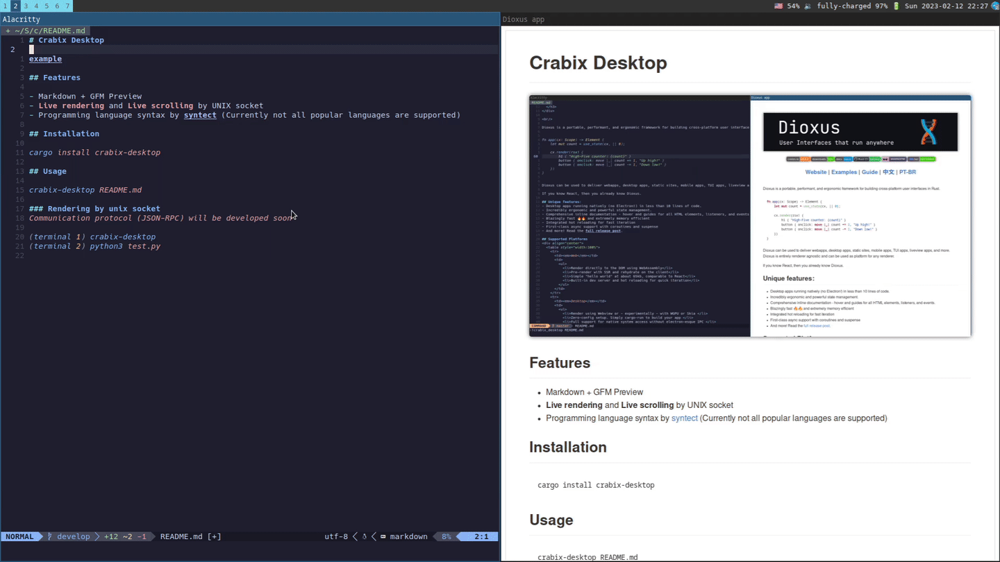

# Crabix-desktop.nvim

Neovim plugin (client) to communicate with [crabix-desktop](https://github.com/kurotych/crabix-desktop) by Unix socket.  
In early **testing & development stage**. But I already use it on my Linux machine for daily routines.



## Requerements 
- Linux or MacOS (since communication by Unix socket)
- Installed [crabix-desktop](https://github.com/kurotych/crabix-desktop) (>=0.2 version)

## Installation

### Packer.nvim

```lua
use("kurotych/crabix-desktop.nvim")
```

## Bindings
```lua
-- Run markdown preview for current buffer
vim.keymap.set("n", "mp", ":lua require'crabix-desktop'.markdown_preview()<CR>", { silent = true })
```
